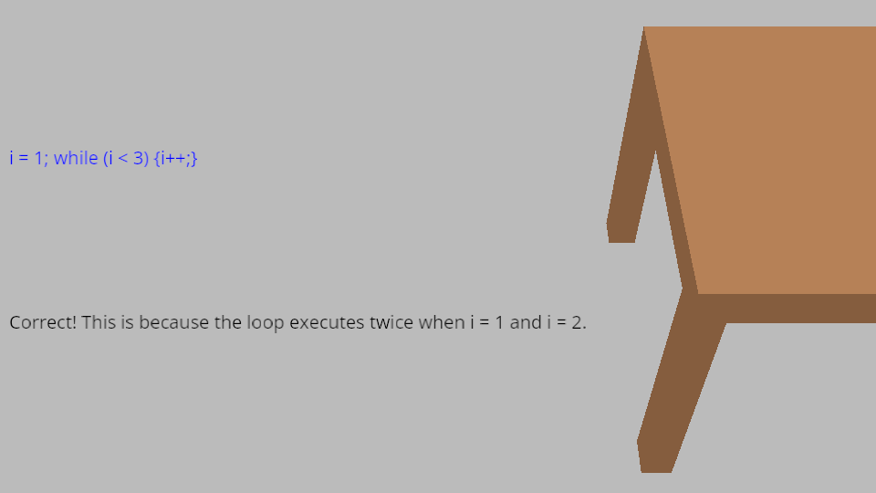

# (TODO: your game's title)

Author: (TODO: your name)

Design: (TODO: In two sentences or fewer, describe what is new and interesting about your game.)

Text Drawing: (TODO: how does the text drawing in this game work? Is text precomputed? Rendered at runtime? What files or utilities are involved?)

Choices: (TODO: how does the game store choices and narrative? How are they authored? Anything nifty you want to point out?)

Screen Shot:

How To Play:

(TODO: describe the controls and (if needed) goals/strategy.)

Sources: (TODO: list a source URL for any assets you did not create yourself. Make sure you have a license for the asset.)

- Open Sans font: https://fonts.google.com/specimen/Open+Sans
- "Rocket" by Kevin MacLeod (incompetech.com / https://incompetech.com/music/royalty-free/music.html)
    Licensed under Creative Commons: By Attribution 4.0 License
    http://creativecommons.org/licenses/by/4.0/

Other credits:
- https://github.com/harfbuzz/harfbuzz-tutorial/blob/master/hello-harfbuzz-freetype.c and in general the entire HarfBuzz tutorial repository
- https://learnopengl.com/In-Practice/Text-Rendering for advice on getting the FreeType glyphs to work and putting them in OpenGL

This game was built with [NEST](NEST.md).

